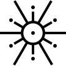
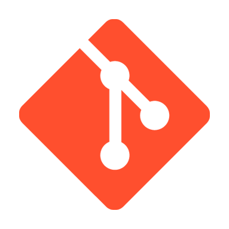
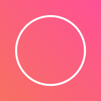

## Hello, world!

<a href="https://github.com/anuraghazra/github-readme-stats">
  <!--
  Width refers to the document's width. Using a 40% allows GitHub's iOS app to
  look decent
  -->
  
</a>

I'm Altair, a Software Engineering student at UMA

- Backend first developer
- Fascinated by functional programming
- Focused on building fast &amp; reliable software
- Interested in Microservices, Serverless and Distributed systems

 

## Languages and Tools

  <!--Rust-->
  
  <!--Tokio-->
  
  <!--Rocket-->
  
  <!--Yew-->
  
  <!--Java-->
  
  <!--Hibernate-->
  
  <!--Spring-->
  
  <!--Python-->
  
  <!--FastAPI-->
  
  <!--TypeScript-->
  
  <!--Deno-->
  
  <!--Open API-->
  
  <!--Docker-->
  
  <!--JetBrains Tools-->
  
  <!--Visual Studio Code-->
  
  <!--Git-->
  
  <!--GitHub-->
  
  <!--Conventional commits-->
  
  <!--UNIX OS-->
  
  <!--Kubernetes-->
  

## Learn next

  <!--Apache Kafka-->
  
  <!--Apache Pulsar-->
  
  <!--Elixir-->
  
  <!--Scala-->
  
  <!--Function Mesh-->
  
  <!--OpenFaaS-->
  

