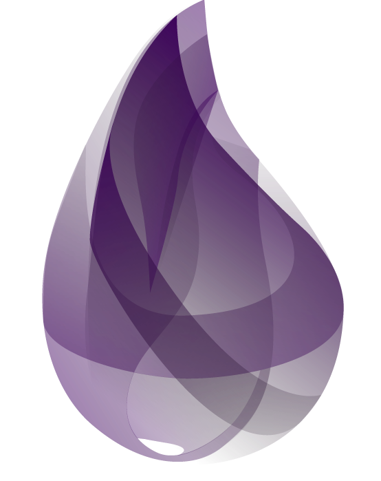

## Hello, world!

<a href="https://github.com/anuraghazra/github-readme-stats">
  <!--
  Width refers to the document's width. Using a 40% allows GitHub's iOS app to
  look decent
  -->
  
</a>

I'm Altair, a Software Engineering student at UMA

  - Backend first developer
  - Fascinated by functional programming
  - Focused on building fast &amp; reliable software
  - Interested in Microservices, Serverless and Distributed systems

 

## Languages and Tools

    <!--Rust-->
    
    <!--Tokio-->
    
    <!--Rocket-->
    
    <!--Yew-->
    
    <!--Java-->
    
    <!--Hibernate-->
    
    <!--Spring-->
    
    <!--Python-->
    
    <!--Docker-->
    
    <!--JetBrains Tools-->
    
    <!--Visual Studio Code-->
    
    <!--Git-->
    
    <!--GitHub-->
    
    <!--Conventional commits-->
    
    <!--UNIX OS-->
    

## Learn next

    <!--Kubernetes-->
    
    <!--Apache Kafka-->
    
    <!--GraphQL-->
    
    <!--Hasura-->
    
    <!--Elixir-->
    
    <!--Scala-->
    

